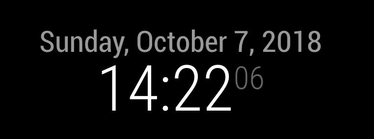

# Module: Clock
The `clock` module is one of the default modules of the SmartMirror.
This module displays the current date and time. The information will be updated realtime.

## Screenshot

- Current time


## Using the module

To use this module, add it to the modules array in the `config/config.js` file:
````javascript
modules: [
	{
		module: "clock",
		position: "top_left",	// This can be any of the regions.
		config: {
			// The config property is optional.
			// See 'Configuration options' for more information.
		}
	}
]
````
