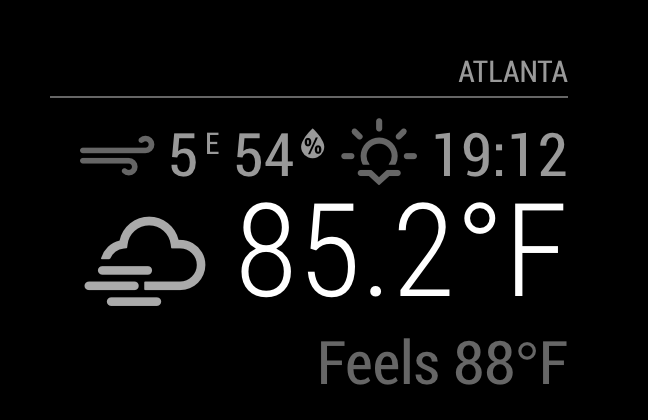

# Module: Current Weather
The `currentweather` module is one of the default modules of the SmartMirror.
This module displays the current weather, including the windspeed, the sunset or sunrise time, the temperature and an icon to display the current conditions.

## Screenshot

- Current weather screenshot


## Using the module

To use this module, add it to the modules array in the `config/config.js` file:
````javascript
modules: [
	{
		module: "currentweather",
		position: "top_right",	// This can be any of the regions.
									// Best results in left or right regions.
		config: {
			// See 'Configuration options' for more information.
			location: "Amsterdam,Netherlands",
			locationID: "", //Location ID from http://openweathermap.org/help/city_list.txt
			appid: "abcde12345abcde12345abcde12345ab" //openweathermap.org API key.
		}
	}
]
````

#### Default Icon Table
````javascript
iconTable: {
	'01d': 'wi-day-sunny',
	'02d': 'wi-day-cloudy',
	'03d': 'wi-cloudy',
	'04d': 'wi-cloudy-windy',
	'09d': 'wi-showers',
	'10d': 'wi-rain',
	'11d': 'wi-thunderstorm',
	'13d': 'wi-snow',
	'50d': 'wi-fog',
	'01n': 'wi-night-clear',
	'02n': 'wi-night-cloudy',
	'03n': 'wi-night-cloudy',
	'04n': 'wi-night-cloudy',
	'09n': 'wi-night-showers',
	'10n': 'wi-night-rain',
	'11n': 'wi-night-thunderstorm',
	'13n': 'wi-night-snow',
	'50n': 'wi-night-alt-cloudy-windy'
}
````
