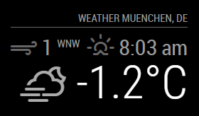
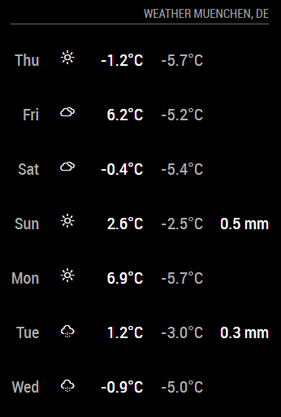

# Weather Module

This module is aimed to be the replacement for the current `currentweather` and `weatherforcast` modules. The module will be configurable to be used as a current weather view, or to show the forecast. This way the module can be used twice to fullfil both purposes.

The biggest change is the use of weather providers. This way we are not bound to one API source. And users can choose which API they want to use as their source.

The module is in a very early stage, and needs a lot of work. It's API isn't set in stone, so keep that in mind when you want to contribute.

## Example

 

## Usage

To use this module, add it to the modules array in the `config/config.js` file:

````javascript
modules: [
	{
		module: "weather",
		position: "top_right",
		config: {
			// See 'Configuration options' for more information.
			type: 'current'
		}
	}
]
````
### Darksky options

| Option                       | Description
| ---------------------------- | -----------
| `apiBase`                    | The DarkSky base URL. The darksky api has disabled [cors](https://developer.mozilla.org/en-US/docs/Web/HTTP/CORS), therefore a proxy is required. <br><br> **Possible value:**  `'https://cors-anywhere.herokuapp.com/https://api.darksky.net'` <br>  This value is **REQUIRED**
| `weatherEndpoint`	           | The DarkSky API endPoint. <br><br> **Possible values:** `/forecast` <br>  This value is **REQUIRED**
| `apiKey`                     | The [DarkSky](https://darksky.net/dev/register) API key, which can be obtained by creating an DarkSky account. <br><br>  This value is **REQUIRED**
| `lat`                        | The geo coordinate latitude. <br><br>  This value is **REQUIRED**
| `lon`                        | The geo coordinate longitude. <br><br>  This value is **REQUIRED**

## API Provider Development

If you want to add another API provider checkout the [Guide](providers).
